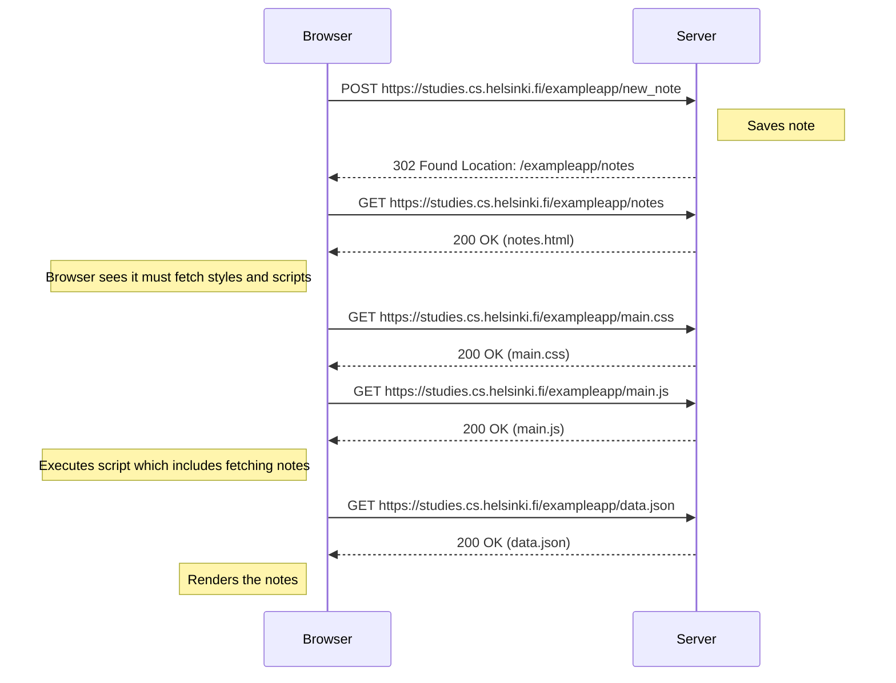

```mermaid
sequenceDiagram
Browser->>Server: POST https://studies.cs.helsinki.fi/exampleapp/new_note
Note right of Server: Saves note
Server-->>Browser: 302 Found Location: /exampleapp/notes
Browser->>Server: GET https://studies.cs.helsinki.fi/exampleapp/notes
Server-->>Browser: 200 OK (notes.html)
Note left of Browser: Browser sees it must fetch styles and scripts
Browser->>Server: GET https://studies.cs.helsinki.fi/exampleapp/main.css
Server-->>Browser: 200 OK (main.css)
Browser->>Server: GET https://studies.cs.helsinki.fi/exampleapp/main.js
Server-->>Browser: 200 OK (main.js)
Note left of Browser: Executes script which includes fetching notes
Browser->>Server: GET https://studies.cs.helsinki.fi/exampleapp/data.json
Server-->>Browser: 200 OK (data.json)
Note left of Browser: Renders the notes
```
