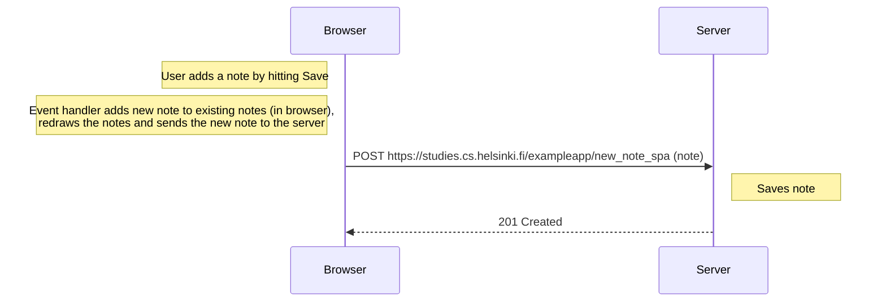

```mermaid
sequenceDiagram
Note left of Browser: User adds a note by hitting Save
Note left of Browser: Event handler adds new note to existing notes (in browser),<br/>redraws the notes and sends the new note to the server
Browser->>Server: POST https://studies.cs.helsinki.fi/exampleapp/new_note_spa (note)
Note right of Server: Saves note
Server-->>Browser: 201 Created
```
